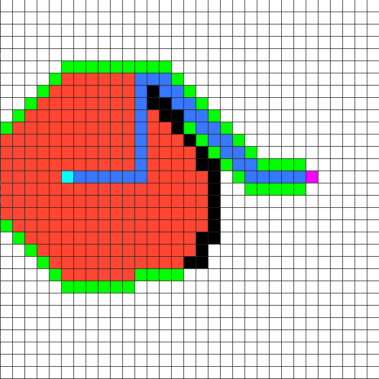

# pathfinding_visualization
An app built with C++ and SFML that visually demonstrates the A* pathfinding algorithm and various maze generation algorithms.

# Requirements to Build from Source
C++ 17

The SFML graphics library for your platform:

https://www.sfml-dev.org/

# More Information

When running A*, the red tiles represent ones that have been explored already, while the green tiles represent tiles to explore in the future. The cyan tile represents the start and the magenta tile represents the destination.

The two maze generation algorithms used are a randomized depth-first search and Wilson's Algorithm. Wilson's Algorithm may take a long time to run on very large grids due to the nature of the algorithm, so increasing the framerate and/or frameskip will speed things up. 

# Usage and Controls

1. Either download the precompiled executable for Windows or build from source.
2. Run the executable, optionally via a command line.

Controls:

**Left Click**: Draw walls.

**Right Click**: Remove walls.

**Spacebar**: Run A* pathfinding.

**R**: Reset all tiles.

**S**: Place the start tile (cyan).

**E**: Place the end tile (magenta).

**M**: Generate a maze using a randomized depth-first search.

**N**: Generate a maze using Wilson's Algorithm, a loop-erased random walk. 

Press **Escape** at any time to stop pathfinding/maze generation.

# Optional command line arguments

The executable can be ran with any combination of these optional arguments at the command line, separated by spaces (int represens an integer number):

`-diagonal`

Enables diagonal movement (off by default).
  

`-width int`

Sets the width of the window in pixels.
  

`-height int`

Sets the height of the window in pixels.
  

`-tile int`

Sets the width/height of the tiles in pixels.
  

`-fps int`

Sets the maximum FPS of the app. Higher numbers will make the app run faster. Set to 0 to disable the limit.
  

`-padding int`

Sets the padding, in pixels, between tiles. A padding of 0 may look best when generating mazes or using many tiles.
  

`-skip int`

Sets the amount of frames to skip between screen updates. Use this if you get low performance when using many tiles.
  

An example combining all of these (on Windows) would look like this:

`pathfinding_visualization.exe -width 800 -height 800 -tile 19 -fps 120 -padding 1 -skip 0 -diagonal`

# Demonstration

Check out a video demonstration by clicking the image below:

# Further Reading

https://en.wikipedia.org/wiki/A*_search_algorithm

https://en.wikipedia.org/wiki/Maze_generation_algorithm